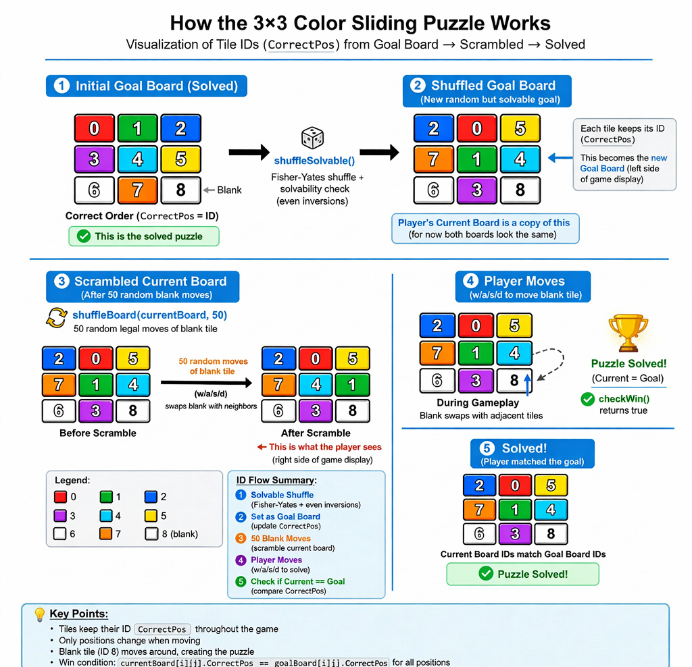

# Color Sliding Puzzle (Go Console Game)

---

## Description

The Color Sliding Puzzle is a console application game written in Go. The user
is presented with a 3x3 colored grid with one empty square that indicates
the position of the user. The user then has to match the grid shown on the left
by moving the squares within the grid around.

---

## Requirements

- Go 1.26.0 (run `go version` in a terminal to confirm)
- terminal that supports ANSI colors

---

## How to Play

When the program is running, the user will first be greeted with a
title screen that describes the left and right 3x3 puzzles:

- Left: finished display goal
- Right: current board

The user's job is to use keys to move an empty square within the current board grid,
which moves the other squares around, to match the finished display goal on the left.

Here is a quick set of instructions on how to control the game:

### Controls
- **W** - Move up
- **A** — Move view left
- **S** - Move down
- **D** — Move view right

---

## How to Run

1. Clone this GitHub repository into your desired directory.
2. Navigate to your desired directory, then navigate to the cloned repository and run the following command:

   ```bash
   go run main.go
   ```
Once you have run this command within your terminal, the game will be up and running!

---

## Tile Generation Feature

The most significant feature within this program is the tile generation. Below is a visual diagram on how it works, followed by a more in-depth decription:



Each tile in the puzzle is represented by a `Tile` struct, and the program creates
a slice of pointers to `Tile` using `createTiles()`. Each tile pointer stores its color,
whether it is blank, and its `CorrectPos` ID. The 1D slice of tile pointers is then converted
into a 2D board with `createBoard()`. Shuffling is done either by randomly rearranging the
pointers in the slice (`shuffleSolvable`) or by performing legal moves of the blank tile (`shuffleBoard`).
Because the board holds pointers to tiles, swapping tiles only changes which tile occupies
a given position without copying the tile data itself, making moves efficient and consistent
with the goal board.

---

## Future Improvements

With more time allowed and effort mustered, these are some future
improvements I would like to make on this project:

- Larger puzzle grids
    - Upgrading the grids to 4x4, 5x5 sizes and beyond would make for more difficult puzzles for the user
- Sound effects
  - Adding sounds effects for when tiles are moved, the puzzle is complete, invalid moves are made, etc.

---

## Closing Remarks

This Color Sliding Puzzle game was created to strengthen my understanding of Go, pointers,
and console-based interactive application development.
It combines data structures, randomization logic, and ANSI-based visual output
to create a vibrant and engaging puzzle game experience.

Have fun playing the Color Sliding Puzzle game!